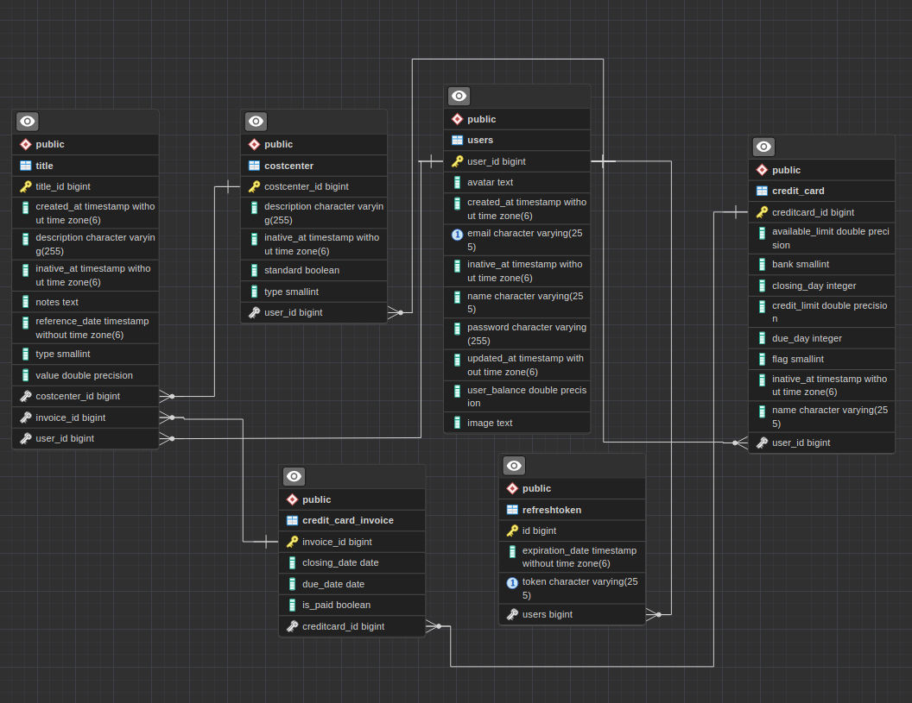
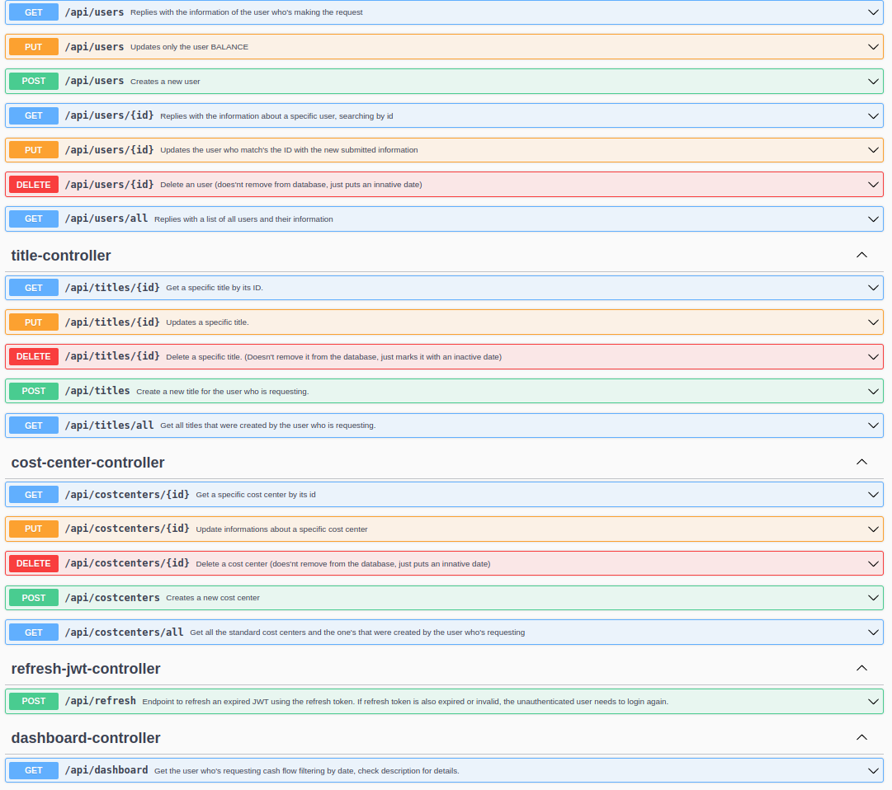

<h1 align="center">my expenses.</h1>

Personal expenses backend project made in Java and Spring Boot 3.0.5. It has complete documentation with Swagger and JWT + refresh token.

<h2 align="center">Database</h2>

<h2 align="center">Swagger Documentation</h2>

Tecnologias utilizadas:
 Java 17
 Spring 3.0.5
 JWT
 Hibernate
 PostgreSQL
 Swagger
 Git e GitHub

